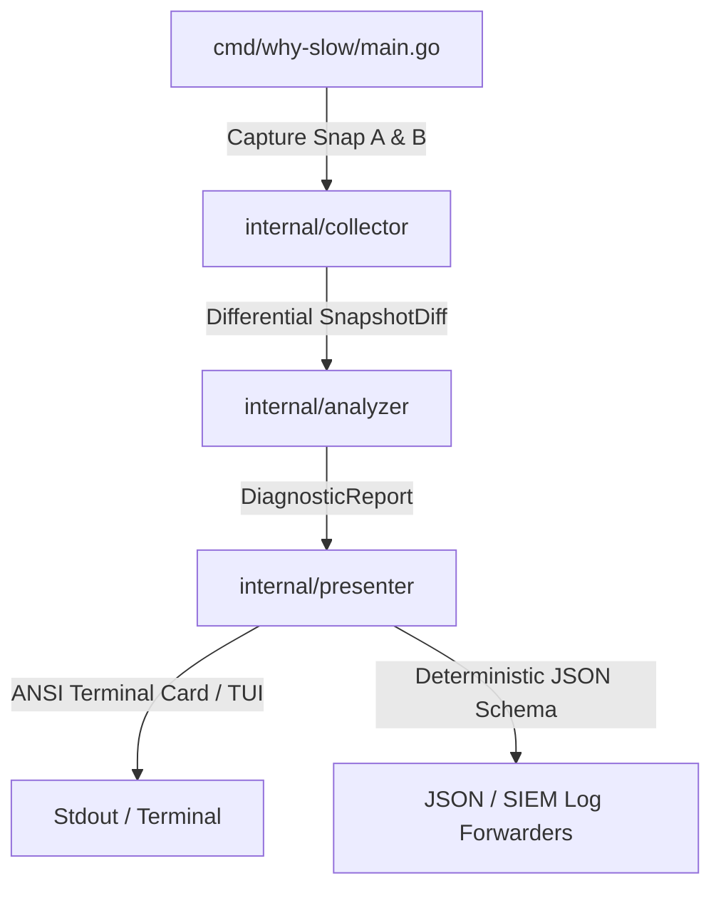

# why-slow — Enterprise Architecture & Technical Specification

`why-slow` is an ultra-fast, zero-dependency Linux performance diagnostic engine engineered for enterprise infrastructure and financial environments. It deterministically isolates the root cause of system slowness in under 1 second by introspecting kernel virtual filesystems (`/proc` and `/sys`), computing high-resolution differentials between two discrete snapshots, and correlating telemetry across **160 prioritized diagnostic rules**.

---

## 🏛️ System Overview & Unidirectional Pipeline



### Core Architectural Invariants

1. **Zero External Dependencies & Pure Go**: Built strictly with the Go Standard Library. `CGO_ENABLED=0`, no dynamic C runtime linkage, and zero subprocess wrapping (`exec.Command` to `ps`, `lsof`, or `iostat` is strictly forbidden).
2. **Opportunistic Elevation**: Operates 100% as an unprivileged regular user with graceful degradation. Elevation (`sudo why-slow`) simply widens process visibility across multi-tenant boundaries via the identical code paths without modifying behavior.
3. **Mathematical Zero-Write Guarantee**: Strictly read-only (`O_RDONLY`). Zero temporary files created on disk (`/tmp`, `/dev/shm`), zero state files, and zero syscall state mutations.
4. **Bounded Concurrency & Deterministic Budgets**: Concurrent process introspection strictly bounded to `runtime.NumCPU()` worker goroutines with explicit `context.Context` cancellation and `< 15MB` RSS memory ceiling.

---

## 📦 Package Layout & Dependency Boundaries

The codebase enforces a strict unidirectional dependency graph where higher layers consume lower layers, but lower layers have zero knowledge of higher layers:

```
why-slow/
├── cmd/
│   └── why-slow/
│       └── main.go                 # CLI entrypoint, flag parsing, signal trap, RunContext init
├── internal/
│   ├── collector/                  # Pure virtual filesystem collectors & diff computation
│   │   ├── snapshot.go             # SystemSnapshot, SnapshotDiff, DiffSnapshots() orchestrator
│   │   ├── cpu.go                  # /proc/stat, cpufreq, thermal sysfs sensors
│   │   ├── memory.go               # /proc/meminfo, /proc/vmstat, slabinfo
│   │   ├── disk.go                 # /proc/diskstats, statfs() mount capacity
│   │   ├── process.go              # Bounded worker pool scanning /proc/[pid]/*
│   │   ├── cgroup.go               # Cgroup v1/v2 cpu.stat and memory.events
│   │   ├── psi.go                  # /proc/pressure/{cpu,memory,io}
│   │   ├── system.go               # sysctls, netstat, sockstat, buddyinfo, interrupts
│   │   ├── tcp_sockets.go          # /proc/net/tcp, /proc/net/tcp6 parsing
│   │   ├── vm_config.go            # Kernel sysctl parameters and limits
│   │   └── median.go               # Multi-sample statistical noise reduction
│   ├── analyzer/                   # Intelligence Engine & 160 Diagnostic Rules
│   │   ├── types.go                # Diagnosis, Severity, Rule interface definitions
│   │   ├── engine.go               # Priority evaluator, deduplicator & root cause demotion
│   │   ├── tier1_base.go           # Tier 1 (P0): Base Hard Limits (13 rules)
│   │   ├── tier2_contention.go     # Tier 2 (P1): Contention & Queuing (84 rules)
│   │   └── tier3_edge.go           # Tier 3 (P2): Subtle Kernel Edge Cases (63 rules)
│   └── presenter/                  # Output rendering & formatting
│       ├── terminal.go             # ANSI stylized diagnosis card output
│       ├── json.go                 # Machine-readable JSON output (Draft 2020-12 schema)
│       └── tui/                    # Interactive raw terminal UI drill-down
├── docs/                           # Enterprise documentation suite
│   ├── ARCHITECTURE.md             # System architecture & STRIDE threat model
│   ├── OPERATIONS_RUNBOOK.md       # SRE operations, systemd, Kubernetes DaemonSet
│   ├── INTEGRATION_GUIDE.md        # SIEM, Splunk, Elastic, Datadog integration
│   ├── RULES_CATALOG.md            # Exhaustive catalog of all 160 diagnostic rules
│   ├── DIAGNOSTIC_DISAMBIGUATION.md# Disambiguation matrices & demotion hierarchy
│   └── MASTER_BENCHMARK.md         # Benchmark scaling & stress verification results
├── Makefile                        # Build, test, and audit automation
├── LICENSE                         # MIT License
└── go.mod                          # Go module definition (Go 1.22+, stdlib only)
```

---

## 🔄 Execution Pipeline & Data Flow


---

## 🛡️ Formal STRIDE Threat Model

To meet institutional banking security requirements, the system architecture is evaluated under the Microsoft STRIDE Threat Model:

```
┌─────────────────────────────────────────────────────────────────────────────┐
│                         STRIDE THREAT ANALYSIS                              │
├───────────────────────┬─────────────────────────────────────────────────────┤
│ Threat Category       │ Architectural Mitigation in why-slow                │
├───────────────────────┼─────────────────────────────────────────────────────┤
│ **Spoofing**          │ All metrics are sourced directly from Linux kernel   │
│                       │ virtual interfaces (/proc, /sys). Ephemeral PID     │
│                       │ recycling is handled via safe stat parsing.          │
├───────────────────────┼─────────────────────────────────────────────────────┤
│ **Tampering**         │ Strict Zero-Write Guarantee. Binary opens all files  │
│                       │ with O_RDONLY; never creates, alters, or unlinks     │
│                       │ any file on the host filesystem.                     │
├───────────────────────┼─────────────────────────────────────────────────────┤
│ **Repudiation**       │ Diagnostic reports include deterministic UTC ISO-8601│
│                       │ timestamps, host privilege levels, and verifiable   │
│                       │ kernel evidence arrays for immutable SIEM logging.  │
├───────────────────────┼─────────────────────────────────────────────────────┤
│ **Information**       │ Strict blacklist prohibits reading memory layouts    │
│ **Disclosure**        │ (/proc/[pid]/maps), environment secrets (/environ), │
│                       │ or customer file paths (zero readlink on /proc/*/fd)│
├───────────────────────┼─────────────────────────────────────────────────────┤
│ **Denial of**         │ CPU worker pool bounded to runtime.NumCPU(); memory │
│ **Service**           │ ceiling < 15MB RSS; zero regex; pre-allocated slices│
│                       │ guarantee zero host resource exhaustion.            │
├───────────────────────┼─────────────────────────────────────────────────────┤
│ **Elevation of**      │ Opportunistic elevation only. Zero setuid binaries, │
│ **Privilege**         │ zero capability manipulation (CAP_*), privilege-     │
│                       │ unaware collectors prevent privilege escalation.    │
└───────────────────────┴─────────────────────────────────────────────────────┘
```

---

## 🔒 Mathematical Proof of the Zero-Write Guarantee

In high-assurance banking systems, diagnostic tools must guarantee zero state modification:

1. **Static Analysis & Linkage**:
   - `os.Create`, `os.WriteFile`, `os.Remove`, `os.Rename`, `os.Chmod`, and `os.Mkdir` are completely absent from the Go source tree.
   - Verified via automated static analysis:
     ```bash
     grep -rnE 'os\.(Create|WriteFile|Remove|Rename|Chmod|Mkdir)' internal/ cmd/
     # Returns 0 matches
     ```
2. **Read-Only Descriptor Enforcement**:
   - All filesystem handles are opened with standard `os.Open` (which maps internally to `syscall.Open(path, syscall.O_RDONLY, 0)`).
3. **Statfs Syscall Safety**:
   - Disk filesystem capacity and inode consumption are queried exclusively using `syscall.Statfs()`, which executes a non-intrusive metadata lookup without modifying filesystem journals.
4. **Kernel Space Mutation Prevention**:
   - The tool issues zero `ioctl` calls and invokes no external commands (`exec.Command` forbidden).

---

## ⚡ Concurrency & Memory Architecture

### 1. Bounded Worker Pool Pattern
When introspecting running processes in `/proc`, spawning an unbounded goroutine per PID would risk scheduler thrashing and memory spikes during a fork bomb:

```go
// Worker pool bounded strictly to CPU core count
numWorkers := runtime.NumCPU()
pidChan := make(chan int, len(pids))
var wg sync.WaitGroup

for w := 0; w < numWorkers; w++ {
    wg.Add(1)
    go func() {
        defer wg.Done()
        for pid := range pidChan {
            // Sequential PID introspection preserves CPU L1/L2 cache locality
            proc, err := parseProcess(pid)
            if err == nil {
                resultChan <- proc
            }
        }
    }()
}
```

### 2. High-Performance Zero-Overhead Parsing
- **Zero Regex at Runtime**: Standard regular expressions compile bytecode and allocate on the heap. `why-slow` uses zero regex in all hot paths, utilizing fast byte search primitives (`strings.Cut`, `strings.IndexByte`, `bytes.Fields`).
- **Streaming Line Scanners**: Virtual files (`/proc/stat`, `/proc/vmstat`, `/proc/meminfo`) are read line-by-line via `bufio.Scanner` with pre-allocated 4KB scratch buffers, eliminating `io.ReadAll` heap allocations.
- **Fast Numeric Conversions**: All numbers are parsed using `strconv.ParseUint` and `strconv.ParseInt`, avoiding the reflection overhead of `fmt.Sscanf`.
- **Heap Allocation Budget**: Slice buffers are pre-allocated with known capacity (`make([]T, 0, capacity)`), keeping total memory allocation under **8.0 MB** in standard operation (< 15.0 MB under 5,000 active PIDs).

---

## 🎯 Multi-Tier Intelligence Hierarchy

Diagnostic rules are stratified into three strict priority tiers to eliminate alert fatigue and ensure the primary bottleneck is never obscured by downstream symptoms:

```
┌────────────────────────────────────────────────────────────────────────┐
│  Tier 1: Base Hard Limits (P0 Priority — 13 Rules)                     │
│  CPU Saturation • OOM Imminent • Disk Full • Thermal Throttling        │
│  HW Disk Saturation • Inode Depletion • SAN Latency • Swap Saturation  │
│  Conntrack 100% Full • Host Kernel OOM Kill • System File Table Full   │
└───────────────────────────────────┬────────────────────────────────────┘
                                    │ (Causal Suppression & Demotion)
                                    ▼
┌────────────────────────────────────────────────────────────────────────┐
│  Tier 2: Contention & Queues (P1 Priority — 84 Rules)                  │
│  D-State Pileup • Swap Thrashing • Cgroup Quota Throttled • FD Limit   │
│  SoftIRQ Storm • TCP Listen Drops • SYN Backlog • blk-mq Starvation    │
│  vCPU Steal • Conntrack Full • ARP Cache Overflow • Page Table Locks   │
│  CLOSE_WAIT Socket Leaks • Sustained Load Overload • Runaway CPU Hog   │
└───────────────────────────────────┬────────────────────────────────────┘
                                    │ (Demotes)
                                    ▼
┌────────────────────────────────────────────────────────────────────────┐
│  Tier 3: Subtle Kernel Edge Cases (P2 Priority — 63 Rules)             │
│  THP Compaction Stall • PTY / Pipe Lock • Degraded Clocksource (HPET)  │
│  Futex Contention • NUMA Remote Overhead • CPU Pinning • Zombie Leaks  │
│  DMA32 Low-Memory • KSM Deduplication • FUSE Daemon Wait Stalls        │
└────────────────────────────────────────────────────────────────────────┘
```
