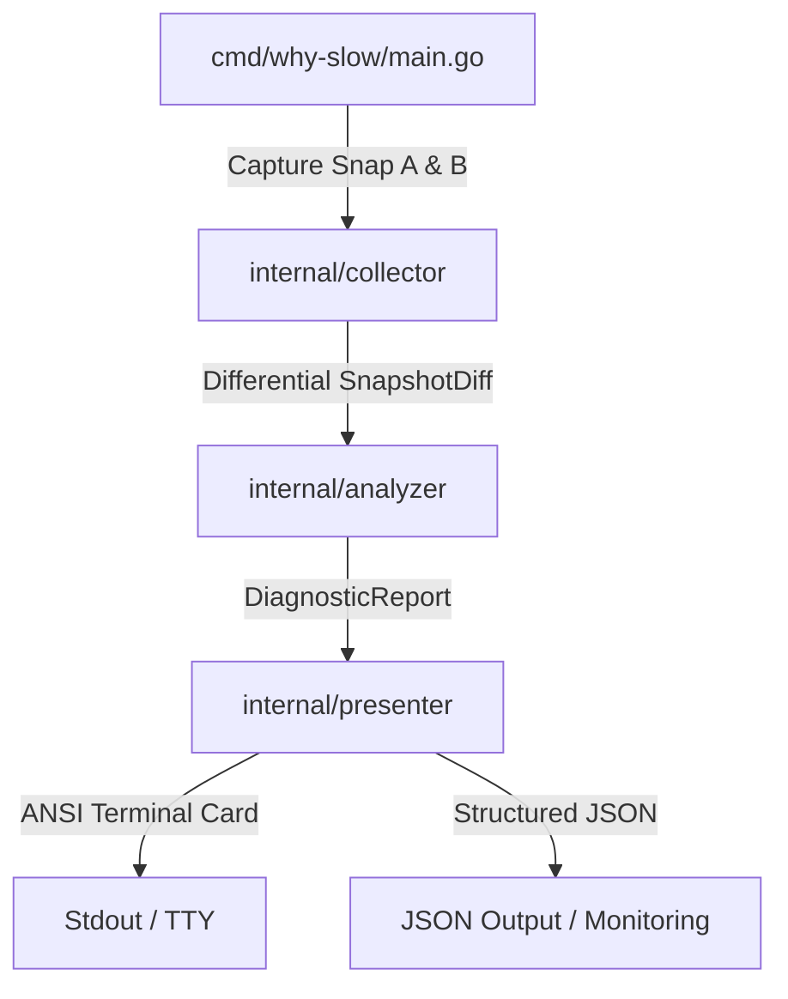
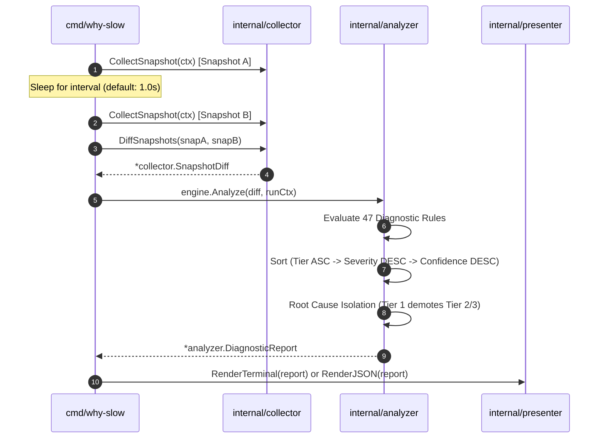

# why-slow — Architecture & Design Specification

`why-slow` is a zero-dependency Linux performance diagnostic CLI tool that pinpoints the root cause of system slowness and bottlenecks within 1 second. It reads directly from `/proc` and `/sys` virtual filesystems, computes high-resolution differentials between two snapshots, and correlates multiple kernel signals through a prioritized multi-tier Intelligence Engine.

---

## 🏛️ System Overview



### Core Architectural Invariants

1. **Zero External Dependencies**: Built strictly with the Go Standard Library. `CGO_ENABLED=0`, no CLI wrapping (`exec.Command` to `ps`, `lsof`, `iostat` is forbidden).
2. **Opportunistic Elevation**: Never *requires* root. Operates fully in unprivileged user mode with graceful degradation. When elevated (`sudo why-slow`), visibility naturally widens through the identical code paths.
3. **Strictly Read-Only**: Zero write operations, temporary files, or privileged ioctls on target systems. Reads exclusively from virtual filesystems (`/proc`, `/sys`, `syscall.Statfs`).
4. **Bounded Concurrency**: CPU-bound worker pools bounded strictly to `runtime.NumCPU()` with `context.Context` cancellation support.

---

## 📦 Package Layout

```
why-slow/
├── cmd/
│   └── why-slow/
│       └── main.go           # CLI entry point, flag parsing, privilege detection
├── internal/
│   ├── collector/            # Virtual filesystem collectors & diff computation
│   │   ├── snapshot.go       # SystemSnapshot, SnapshotDiff, DiffSnapshots()
│   │   ├── cpu.go            # /proc/stat, cpufreq, thermal sensors
│   │   ├── memory.go         # /proc/meminfo, /proc/vmstat
│   │   ├── disk.go           # /proc/diskstats, statfs() filesystem capacity
│   │   ├── process.go        # Bounded worker pool scanning /proc/[pid]/*
│   │   ├── cgroup.go         # Cgroup v2 cpu.stat and memory.events
│   │   ├── psi.go            # /proc/pressure/{cpu,memory,io}
│   │   └── system.go         # sysctls, netstat, sockstat, buddyinfo, interrupts
│   ├── analyzer/             # Intelligence Engine & 47 Diagnostic Rules
│   │   ├── types.go          # Diagnosis, Severity, Rule interface
│   │   ├── engine.go         # Rule evaluation, sorting, root cause isolation
│   │   ├── tier1_base.go     # Tier 1 (P0): Base Hard Limits (9 rules)
│   │   ├── tier2_contention.go # Tier 2 (P1): Contention & Queuing (19 rules)
│   │   └── tier3_edge.go     # Tier 3 (P2): Subtle Kernel Edge Cases (19 rules)
│   └── presenter/            # Rendering & output formatting
│       ├── terminal.go       # ANSI stylized cards, box-drawing, NO_COLOR
│       └── json.go           # Machine-readable JSON output
├── docs/                     # Public user & developer documentation
│   ├── ARCHITECTURE.md       # Architecture & technical specification
│   ├── RULES_CATALOG.md      # Detailed reference of all 47 diagnostic rules
│   ├── CHANGELOG.md          # Release history
│   └── DIAGNOSTIC_DISAMBIGUATION.md # Multi-signal disambiguation matrix
├── Makefile                  # Build, test, and formatting automation
├── LICENSE                   # MIT License
└── go.mod                    # Module definition (Go 1.22+)
```

---

## 🔄 Execution Pipeline



---

## 🛡️ Multi-Tier Intelligence Hierarchy

The correlation engine organizes diagnoses into three strict priority tiers to eliminate alert fatigue and pinpoint true root causes:

```
┌────────────────────────────────────────────────────────────────────────┐
│  Tier 1: Base Hard Limits (P0)                                         │
│  - 100% CPU Saturation, Imminent OOM, Disk Full, Thermal Throttling,   │
│    HW Disk Saturation, Inode Depletion, SAN Latency, Swap Saturation   │
└───────────────────────────────────┬────────────────────────────────────┘
                                    │ (Dominates & Demotes)
                                    ▼
┌────────────────────────────────────────────────────────────────────────┐
│  Tier 2: Contention & Queuing (P1)                                     │
│  - D-State Pileup, Swap Thrashing, Cgroup Throttling, FD Exhaustion,   │
│    SoftIRQ Storm, Ephemeral Port Flood, vCPU Steal, Conntrack Full     │
└───────────────────────────────────┬────────────────────────────────────┘
                                    │ (Demotes)
                                    ▼
┌────────────────────────────────────────────────────────────────────────┐
│  Tier 3: Subtle Kernel Edge Cases (P2)                                 │
│  - THP Compaction Stall, Pipe/PTY Buffer Lock, Degraded Clocksource,   │
│    Futex Contention, NUMA Remote Thrashing, CPU Pinning, Zombie Leaks  │
└────────────────────────────────────────────────────────────────────────┘
```
