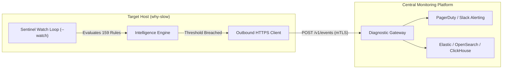

# Future Plans 01: Autonomous Diagnostic Agent Mode

## 1. Executive Summary & Problem Statement

Modern enterprise observability infrastructure relies heavily on metrics-collection agents (e.g. Zabbix Agent, Datadog Agent, Prometheus Node Exporter). While effective at capturing time-series scalars (`cpu_utilization = 98.4%`), these agents are **diagnostically blind**:
* They flood central databases with raw metrics without root-cause correlation.
* They trigger high-noise alerts (e.g. *"Host CPU is high"*) that require on-call SREs to manually SSH into hosts to run `top`, `dmesg`, and `perf`.

The **`why-slow` Autonomous Agent** transforms this paradigm by performing **edge root-cause diagnosis in local host RAM**, evaluating 159 kernel heuristics in sub-millisecond cycles, and transmitting only high-confidence actionable conclusions.

---

## 2. Compared Implementation Paths

```
┌──────────────────────────────────────────────────────────────────────────────────────────┐
│                             AGENT IMPLEMENTATION SPECTRUM                                │
├─────────────────────────┬────────────────────────────┬───────────────────────────────────┤
│ Path                    │ Architecture               │ Pros / Cons                       │
├─────────────────────────┼────────────────────────────┼───────────────────────────────────┤
│ Path A: Outbound Push   │ Agent pushes JSON over     │ ✅ Zero listening ports on host.  │
│         Client          │ HTTPS/mTLS to collector    │ ❌ Requires central collector svc.│
├─────────────────────────┼────────────────────────────┼───────────────────────────────────┤
│ Path B: Sidecar / Pipe  │ Agent outputs JSONL to     │ ✅ Zero new networking code.      │
│         Forwarder       │ journald / Vector / Promtail│ ❌ Relies on external forwarder.  │
├─────────────────────────┼────────────────────────────┼───────────────────────────────────┤
│ Path C: Zabbix Plugin   │ Zabbix Agent invokes       │ ✅ Native integration with Zabbix.│
│         (UserParameter) │ why-slow on-demand         │ ❌ Polling latency (10s-60s).     │
├─────────────────────────┼────────────────────────────┼───────────────────────────────────┤
│ Path D: K8s DaemonSet   │ DaemonSet pod on nodes with│ ✅ Native cloud-native deployment.│
│         & Operator      │ container/cgroup mapping   │ ❌ Kubernetes-specific.           │
└─────────────────────────┴────────────────────────────┴───────────────────────────────────┘
```

---

### Path A: Outbound HTTPS/mTLS Push Agent (`--push-url`)



#### Technical Specification:
* **Command**: `why-slow --watch --push-url https://diag-gateway:8443/v1/events --auth-token-file /etc/why-slow/token --interval 3s --alert-threshold high`
* **Transport**: Pure Go `net/http` client with TLS 1.3 mutual authentication (mTLS).
* **Payload**: Structured `DiagnosticReport` JSON including `PrimaryBlocker`, `KernelEvidence`, `CulpritPID`, and `RemediationIntent`.

---

### Path B: Local Sidecar Forwarding (Zero Network Code)

```bash
# systemd service streaming directly to journald / Vector
why-slow --watch --interval 3s --alert-threshold high --json --compact >> /var/log/why-slow-events.jsonl
```
* **Integration**: Compatible out-of-the-box with **Vector, FluentBit, Logstash, Promtail, Datadog Agent, and Splunk Forwarder**.

---

### Path C: Native Zabbix Agent Integration

In `/etc/zabbix/zabbix_agent2.d/why-slow.conf`:
```ini
UserParameter=whyslow.status,/usr/local/bin/why-slow --json --compact
UserParameter=whyslow.primary_blocker,/usr/local/bin/why-slow --json --compact | jq -r '.primary_blocker.title // "HEALTHY"'
UserParameter=whyslow.psi_cpu,/usr/local/bin/why-slow --json --compact | jq -r '.system_pressure.cpu_stall_percent'
```

---

## 3. Potential Challenges & Security Mitigations

| Challenge | Risk Level | Mitigation Strategy in `why-slow` |
| :--- | :--- | :--- |
| **Inbound Attack Surface** | Critical | **Push-Only Model**: The agent opens **zero listening ports** on the host. It only connects outbound. |
| **Sensitive Credential Leak** | Critical | **Strict Path Invariant**: Never reads `/proc/[pid]/environ`, `/proc/[pid]/maps`, or memory layouts. |
| **Production Resource Drag** | High | **Hard Execution Limits**: Enforces $< 15\text{ MB}$ RSS, $< 0.05\%$ CPU usage, and zero runtime heap growth. |
| **Network Partition / Backpressure**| Medium | **In-Memory Ring Buffer**: Drops old non-critical events if central gateway is unreachable (bounded buffer $\le 100$ events). |
| **Privilege Escalation** | High | **Unprivileged System User**: Runs under `why-slow` system user with `NoNewPrivileges=true` and `ProtectSystem=strict` in systemd. |

---

## 4. Phase-by-Phase Implementation Roadmap

1. **Phase 1: Structured JSON Streaming (Completed in v0.20.0)**
   * Multi-sample filtering (`--samples N`) and Sentinel watch mode (`--watch`).
2. **Phase 2: Outbound Push Client & Webhook Forwarder**
   * Implement pure Go stdlib HTTP client with retry backoff and token authentication.
3. **Phase 3: Kubernetes DaemonSet & Helm Chart**
   * Package as container image with cgroup v2 container name resolution.
4. **Phase 4: Grafana & Zabbix Dashboard Packs**
   * Release official templates visualizing root causes and PSI trends.
