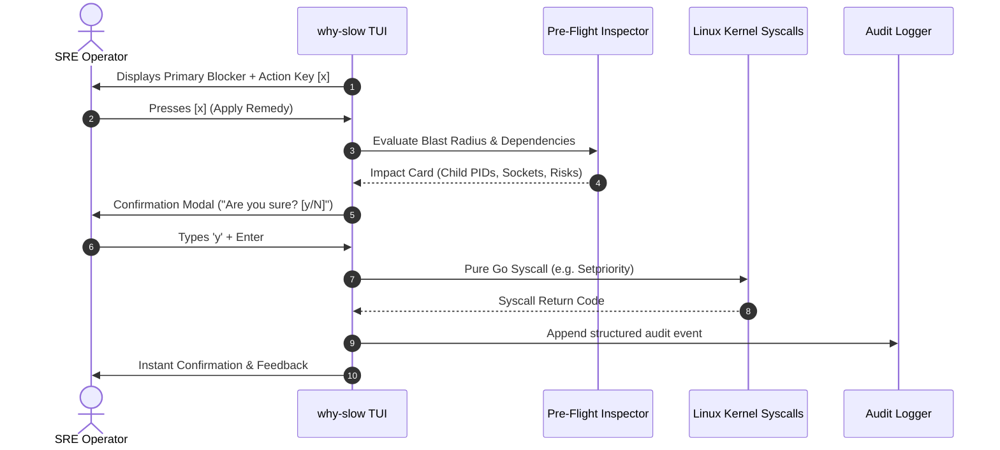

# Future Plans 03: Human-in-the-Loop Remediation Engine

## 1. The Core Philosophy: "No Autonomous Script Execution"

In autonomous system operations, the most catastrophic outages are caused by **automation panic** — scripts that misinterpret transient spikes and kill critical master processes or trigger cascading cluster failovers.

To ensure safety:
* **Background Sentinel Mode (`--watch`) is STRICTLY READ-ONLY**. It will **NEVER** modify, kill, or write anything to the target system.
* **Remediation is exclusively HUMAN-GATED**. It can only be triggered interactively inside the TUI by an authenticated operator who inspects the pre-flight blast radius assessment and explicitly confirms with `[y/N]`.

---

## 2. Interactive Operator Workflow



---

## 3. Pure Syscall Execution Architecture (Zero Shell Injection)

Traditional DevOps tools frequently execute shell commands via `exec.Command("sh", "-c", cmdStr)`. This introduces **critical parameter injection vulnerabilities** where malicious process names (`comm`) or paths can execute arbitrary code.

`why-slow` enforces a **Zero Shell String Invariant**: All remediation actions are implemented via direct Go kernel syscalls:

```go
// VULNERABLE PATTERN (STRICTLY FORBIDDEN IN WHY-SLOW):
// exec.Command("bash", "-c", "renice -n 19 -p " + pidStr)

// SAFE PATTERN (ENFORCED IN WHY-SLOW):
func applyReniceRemedy(pid int, niceValue int) error {
    // Direct Linux kernel syscall — zero shell invocation, zero injection risk
    err := syscall.Setpriority(syscall.PRIO_PROCESS, pid, niceValue)
    if err != nil {
        return fmt.Errorf("remediation: setpriority failed for pid %d: %w", pid, err)
    }
    return nil
}
```

---

## 4. Allowlist of Permitted Remediation Handlers

| Action ID | Intended Effect | Direct Syscall Implementation | Risk Level |
| :--- | :--- | :--- | :--- |
| `ACTION_RENICE_IDLE` | Lowers CPU priority to idle/nice 19 | `syscall.Setpriority(PRIO_PROCESS, pid, 19)` | 🟢 Low (Non-destructive) |
| `ACTION_IONICE_IDLE` | Lowers I/O priority class to idle (`IOPRIO_CLASS_IDLE`) | `syscall.Syscall(SYS_IOPRIO_SET, ...)` | 🟢 Low (Non-destructive) |
| `ACTION_SIGTERM_GRACEFUL`| Sends graceful termination signal | `syscall.Kill(pid, syscall.SIGTERM)` | 🟡 Medium (Service stoppage) |
| `ACTION_SIGKILL_FORCE` | Forces immediate kill *(Double confirmation)* | `syscall.Kill(pid, syscall.SIGKILL)` | 🔴 High (Potential state loss) |
| `ACTION_DROP_PAGECACHE` | Reclaims clean pagecache pages | `os.WriteFile("/proc/sys/vm/drop_caches", []byte("1"), 0)` *(Root only)* | 🟢 Low (Temporary cache cold) |

---

## 5. Tamper-Evident Audit Logging

Every human remediation action executed through the TUI writes an immutable, structured JSON event to `/var/log/why-slow-audit.log`:

```json
{
  "timestamp": "2026-08-31T10:45:00.123Z",
  "operator": {
    "uid": 1000,
    "euid": 0,
    "user": "ismail",
    "tty": "/dev/pts/2"
  },
  "action": {
    "id": "ACTION_RENICE_IDLE",
    "target_pid": 14208,
    "target_comm": "ffmpeg",
    "cgroup": "/system.slice/ffmpeg.service",
    "nice_value": 19
  },
  "pre_flight_summary": {
    "child_process_count": 0,
    "open_tcp_sockets": 0,
    "assessed_blast_radius": "LOW"
  },
  "result": {
    "status": "SUCCESS",
    "error": null
  }
}
```
