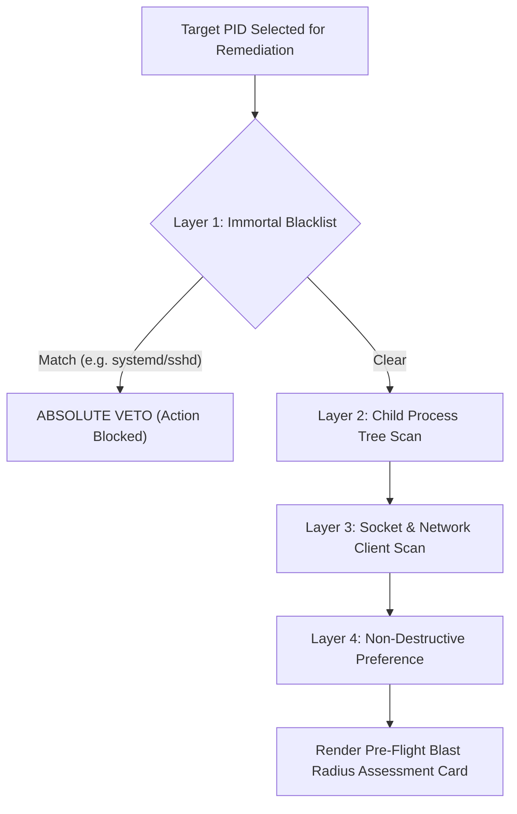

# Future Plans 04: Blast Radius & Pre-Flight Safety Engine

## 1. Problem Statement: The Hidden Cascades of Process Management

In complex Linux server environments, killing or stopping a process without dependency awareness often triggers severe unintended outages:

```
┌─────────────────────────────────────────────────────────────────────────────┐
│                       THE 4 CASCADING OUTAGE SCENARIOS                      │
├─────────────────────────────────────────────────────────────────────────────┤
│ 1. Master Process Kill: Terminating an Nginx/PHP-FPM/Celery master abruptly │
│    kills 30 worker children and aborts hundreds of active user requests.    │
│ 2. Self-Lockout: Terminating the SSH daemon (sshd) permanently severs the   │
│    operator's remote connection to the server.                              │
│ 3. Database Mid-Write Corruption: Forcing SIGKILL on a database writer      │
│    triggers dirty page writeback failures and hours of crash recovery.      │
│ 4. Broken IPC Sockets: Stopping a daemon listening on a Unix domain socket   │
│    instantly crashes all downstream microservices connected to that socket. │
└─────────────────────────────────────────────────────────────────────────────┘
```

To eliminate blind operator actions, `why-slow` incorporates a **Pre-Flight Blast Radius & Dependency Inspection Engine** that runs before any human confirmation modal is displayed.

---

## 2. The 4 Pre-Flight Safety Inspection Layers



---

### Layer 1: The "Immortal Daemon" Blacklist (Hard Protection)

`why-slow` will **strictly refuse** to offer termination or destructive actions against critical operating system stability daemons:

* `PID 1` (`init`, `systemd`)
* `PID 2` (`kthreadd` and all kernel threads where `PPID == 2`)
* Current operator's active `sshd` session (detects controlling TTY from `/proc/[pid]/stat` field 7 to prevent self-lockout)
* Critical container & cluster runtimes: `kubelet`, `containerd`, `dockerd`, `systemd-journald`

---

### Layer 2: Process Subtree & Child Worker Cascade Scan

By reading `/proc/[pid]/stat` across all host processes, the engine maps the entire process tree hierarchy where `PPID == targetPID`:

* **Detection**: Identifies if the target is a Master/Supervisor (e.g. `nginx: master`, `php-fpm: master`, `gunicorn: master`, `celery`).
* **Warning Card**: Displays the exact number of child worker PIDs and active threads that will be affected by terminating the parent.

---

### Layer 3: Network & IPC Socket Dependency Mapping

Using `/proc/net/tcp`, `/proc/net/tcp6`, `/proc/net/unix`, and `/proc/[pid]/fd`:

* **Listening Port Detection**: Identifies if the process is binding any TCP/UDP listening ports (`0.0.0.0:80`, `127.0.0.1:5432`).
* **Active Client Connection Count**: Calculates the exact number of established remote client sockets (`ESTABLISHED`) that would suffer an abrupt `ECONNRESET` disconnect.

---

### Layer 4: The "Throttle, Don't Kill" First Principle

The engine enforces a hierarchical remediation preference:

1. **First Recommendation (Non-Destructive)**:
   * CPU Throttle: `renice -n 19 -p <PID>`
   * I/O Throttle: `ionice -c3 -p <PID>`
   * *Rationale*: A throttled process **does not crash or drop connections**. It continues servicing health-checks and flushes its database buffers, but yields 95% of host CPU and disk bandwidth back to critical workloads.
2. **Second Recommendation (Graceful Reload / Terminate)**:
   * `kill -HUP <PID>` (Configuration reload / worker recycle) or `kill -TERM <PID>` (Graceful shutdown).
3. **Last Resort (Force Kill — Requires Explicit PIN / Double Confirmation)**:
   * `kill -KILL <PID>`

---

## 3. Pre-Flight Blast Radius UI Specification

```text
┌──────────────────────── PRE-FLIGHT IMPACT ASSESSMENT ────────────────────────┐
│ Target Process:  PID 4120 [nginx: master process]                             │
│ Service Cgroup:  /system.slice/nginx.service                                 │
│ Blast Radius:    🟡 HIGH (Service & Traffic Impact)                           │
├───────────────────────────────────────────────────────────────────────────────┤
│ ⚠ IDENTIFIED DEPENDENCIES & SIDE EFFECTS:                                     │
│                                                                               │
│ 1. Child Worker Cascade:                                                      │
│    • Target process owns 16 active worker processes (PIDs 4121–4136).         │
│    • Terminating parent will cascade kill all 16 worker processes.            │
│                                                                               │
│ 2. Active Network Traffic:                                                    │
│    • Listening Ports: 0.0.0.0:80, 0.0.0.0:443                                 │
│    • Connected Clients: 1,420 active TCP connections will be reset.           │
│                                                                               │
│ 3. Storage Descriptors:                                                       │
│    • Holding 12 open file descriptors to /var/log/nginx/access.log           │
├───────────────────────────────────────────────────────────────────────────────┤
│ AVAILABLE REMEDIAL PATHS:                                                     │
│   ▶ [1] Non-Destructive Throttle: renice -n 19 -p 4120 (Zero traffic loss)   │
│     [2] Graceful Worker Reload:   kill -HUP 4120       (Zero downtime)        │
│     [3] Force Terminate Service:  kill -TERM 4120      (Drops 1,420 clients!) │
└───────────────────────────────────────────────────────────────────────────────┘
```
