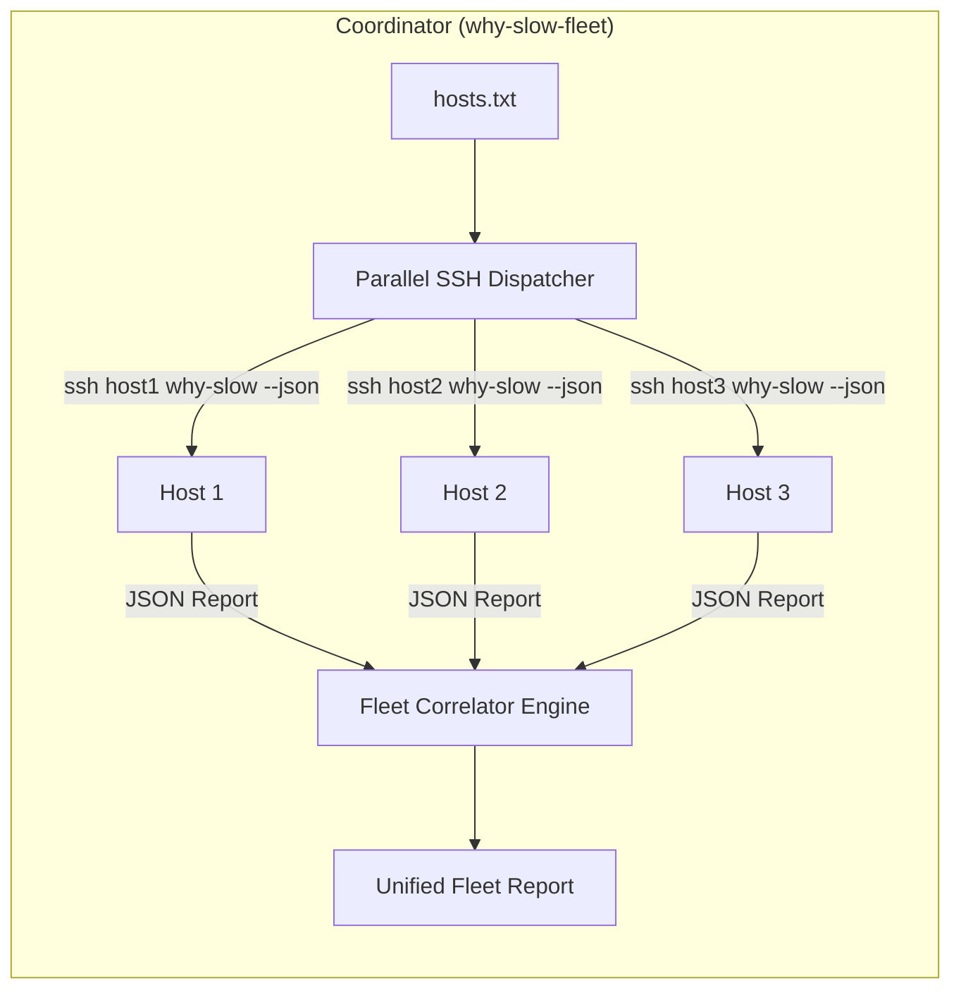
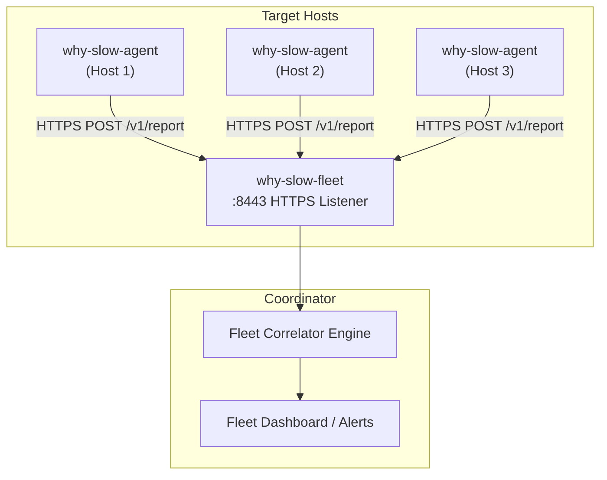

# Future Plans 05: Multi-Host Distributed Diagnostics

## 1. Executive Summary & Problem Statement

Single-host diagnostic tools — including the current `why-slow` — operate in isolation. They can tell you **"this machine is CPU-saturated"** but cannot answer **"is every database replica CPU-saturated, or just this one?"** In clustered environments (Kubernetes node pools, database replica sets, Kafka brokers, Redis Sentinel groups), performance bottlenecks are frequently **correlated across hosts**:

* A thundering-herd reconnection storm saturates all N app servers simultaneously.
* A single degraded NFS server causes D-state pileups on 50 client machines.
* A network partition splits a cluster: half the nodes show `TCP_LISTEN_DROPS`, the other half show `TCP_SYN_QUEUE_OVERFLOW`.

Without correlated multi-host visibility, operators must SSH into each machine, run diagnostics individually, mentally diff the outputs, and reconstruct the causal chain. This process takes 15-45 minutes during an active incident.

**The Multi-Host Distributed Diagnostics mode** enables `why-slow` to collect snapshots from multiple hosts simultaneously, correlate their findings into a unified fleet-wide diagnostic report, and surface cross-host patterns that are invisible to single-node analysis.

---

## 2. Compared Implementation Paths

```
┌──────────────────────────────────────────────────────────────────────────────────────────┐
│                         MULTI-HOST IMPLEMENTATION SPECTRUM                               │
├─────────────────────────┬────────────────────────────┬───────────────────────────────────┤
│ Path                    │ Architecture               │ Pros / Cons                       │
├─────────────────────────┼────────────────────────────┼───────────────────────────────────┤
│ Path A: NFS /proc       │ Mount remote /proc via NFS │ ✅ Zero network code in binary.   │
│         Passthrough     │ or sshfs, read locally     │ ❌ Slow, fragile, limited fields. │
├─────────────────────────┼────────────────────────────┼───────────────────────────────────┤
│ Path B: SSH Agent       │ Coordinator SSHs into each │ ✅ No agent deployment needed.    │
│         (Agentless)     │ host, runs why-slow --json │ ❌ Requires SSH keys + Go net/ssh.│
├─────────────────────────┼────────────────────────────┼───────────────────────────────────┤
│ Path C: Coordinator-    │ why-slow-agent on each host│ ✅ Fastest, most reliable.        │
│         Worker Topology │ pushes JSON to coordinator │ ❌ Requires deployment + net code.│
├─────────────────────────┼────────────────────────────┼───────────────────────────────────┤
│ Path D: Offline JSON    │ Collect JSON from hosts    │ ✅ Zero runtime dependencies.     │
│         Merge & Correlate│ then merge via CLI tool   │ ❌ No real-time correlation.      │
└─────────────────────────┴────────────────────────────┴───────────────────────────────────┘
```

---

### Path A: NFS /proc Passthrough (Zero Network Code)

```
┌─────────────────────────────────────────────────────────────────┐
│  Coordinator Host                                               │
│                                                                 │
│  /mnt/host-db01/proc/  ──────► CollectSnapshot(procDir)         │
│  /mnt/host-db02/proc/  ──────► CollectSnapshot(procDir)         │
│  /mnt/host-db03/proc/  ──────► CollectSnapshot(procDir)         │
│                                                                 │
│  ──► CorrelateReports() ──► Unified FleetDiagnosticReport       │
└─────────────────────────────────────────────────────────────────┘
```

#### Technical Specification:
* **Command**: `why-slow --fleet /mnt/host-db01/proc,/mnt/host-db02/proc,/mnt/host-db03/proc`
* **Mechanism**: Reuse existing `ScanProcesses(ctx, procDir)` and `Parse*()` functions with custom base paths.
* **Network Code Required**: **None** — the mounting is handled externally via `mount -t nfs` or `sshfs`.
* **Limitations**:
  - `/proc` over NFS is fragile: many pseudo-files return stale data or cause hangs.
  - `statfs()` syscall targets local mounts only — disk space data is unavailable for remote hosts.
  - sysfs (`/sys/`) is typically not exported via NFS at all — cpufreq, thermal, clocksource, and block device queue data are missing.
  - Latency of NFS reads (~1-5ms per file) could blow the 1-second budget for 500+ PID hosts.

> **Verdict**: Viable as a zero-network-code proof of concept but too fragile for production fleet diagnostics. Best used for post-mortem analysis of `/proc` snapshots saved to disk.

---

### Path B: SSH Agent (Agentless) ⭐ Recommended Initial Path



#### Technical Specification:
* **Command**: `why-slow-fleet --hosts hosts.txt --ssh-key ~/.ssh/id_ed25519 --interval 3s --alert-threshold high`
* **Host File Format** (`hosts.txt`):
  ```
  # hostname   user    port   labels
  db-primary   root    22     role=primary,cluster=pg-prod
  db-replica1  root    22     role=replica,cluster=pg-prod
  db-replica2  root    22     role=replica,cluster=pg-prod
  app-web-01   ubuntu  2222   role=web,cluster=app-prod
  ```
* **Transport**: Pure Go `crypto/ssh` client (stdlib). No `exec.Command("ssh", ...)`.
* **Execution Model**:
  1. Parse host file → bounded worker pool (`min(len(hosts), 16)` goroutines).
  2. Each worker: SSH connect → execute `why-slow --json --compact` → read stdout → parse `DiagnosticReport`.
  3. Collect all reports with timeouts (per-host: 10s, fleet-wide: 30s).
  4. Feed all reports to the Fleet Correlator Engine.
* **Binary Isolation**: Shipped as a **separate binary** (`why-slow-fleet`) or behind `//go:build fleet` build tag to preserve the zero-network-dependency invariant in the core `why-slow` binary.

#### Prerequisites on Target Hosts:
- `why-slow` binary installed at `/usr/local/bin/why-slow` (or PATH-discoverable).
- SSH key-based authentication configured (no password prompts).
- Target hosts reachable on SSH port.

---

### Path C: Coordinator-Worker Topology (Full Agent Mode)



#### Technical Specification:
* **Agent Command**: `why-slow-agent --push-url https://coordinator:8443/v1/report --interval 3s --labels role=db,cluster=pg-prod`
* **Coordinator Command**: `why-slow-fleet --listen :8443 --tls-cert /etc/pki/fleet.pem --tls-key /etc/pki/fleet.key`
* **Protocol**: HTTPS with mTLS client certificates for mutual authentication.
* **Advantages Over SSH**:
  - No SSH access required on target hosts.
  - Agent pushes continuously — no polling latency.
  - Coordinator can maintain sliding-window history for trend analysis.
* **Disadvantages**:
  - Requires agent deployment on every host (Ansible/Chef/Puppet playbook).
  - Coordinator is a stateful long-running service requiring its own HA.
  - Significantly more complex than the SSH approach.

> **Verdict**: Best for large-scale deployments (100+ hosts) with existing configuration management. Overkill for small clusters.

---

### Path D: Offline JSON Merge & Correlate

```bash
# Collect from each host (manually or via ansible/pdsh)
for host in db01 db02 db03; do
    ssh $host "why-slow --json --compact" > reports/$host.json
done

# Correlate offline
why-slow-fleet --merge reports/*.json --output fleet-report.json
```

#### Technical Specification:
* **Command**: `why-slow-fleet --merge report1.json report2.json report3.json`
* **Network Code Required**: **None** — pure file-based I/O.
* **Best For**: Post-mortem incident analysis and CI/CD health checks.
* **Limitation**: No real-time correlation — reports may have clock skew between hosts.

---

## 3. Fleet Correlator Engine — Cross-Host Pattern Detection

The core innovation is the **Fleet Correlator Engine**, which detects patterns invisible to single-host analysis.

### 3.1 Cross-Host Correlation Rules

| Fleet Rule ID | Detection Logic | Example Finding |
| :--- | :--- | :--- |
| `FLEET_THUNDERING_HERD` | ≥ 50% of hosts fire `BASE_CPU_SATURATION` within ±5s window | "8/12 app servers simultaneously hit 100% CPU — likely thundering herd reconnection storm" |
| `FLEET_STORAGE_SERVER_DEGRADATION` | ≥ 3 hosts fire `CONT_DSTATE_PILEUP` with NFS/CIFS wchan functions | "5 hosts blocked in `nfs_wait_bit_killable` — upstream NFS server `nfs01` is degraded" |
| `FLEET_NETWORK_PARTITION` | Cluster splits: subset fires `TCP_LISTEN_DROPS`, complement fires `TCP_SYN_QUEUE_OVERFLOW` | "Network partition detected: hosts {A,B,C} dropping inbound, hosts {D,E,F} failing outbound" |
| `FLEET_CASCADING_OOM` | ≥ 2 hosts fire `BASE_OOM_DANGER` within ±10s window | "Sequential OOM kills across db01→db02→db03 — likely failover cascade overloading replicas" |
| `FLEET_ASYMMETRIC_LOAD` | One host fires while label-group peers are healthy | "db-replica2 is CPU-saturated while db-replica1 and db-replica3 are 15% idle — check load balancer weights" |
| `FLEET_CLOCK_SKEW` | Report timestamps diverge by > 5s across hosts | "Host db03 clock is 12s ahead of cluster median — NTP desync detected" |
| `FLEET_CGROUP_QUOTA_STORM` | ≥ 3 hosts fire `CONT_CGROUP_THROTTLED` on cgroups with matching path patterns | "Kubernetes deployment 'api-server' throttled on 7/10 nodes — global CPU quota too low" |

### 3.2 Fleet Report Structure

```go
// FleetDiagnosticReport represents correlated findings across multiple hosts.
type FleetDiagnosticReport struct {
    Timestamp       string                    `json:"timestamp"`
    HostCount       int                       `json:"host_count"`
    HealthyHosts    int                       `json:"healthy_hosts"`
    DegradedHosts   int                       `json:"degraded_hosts"`
    CriticalHosts   int                       `json:"critical_hosts"`
    FleetFindings   []FleetDiagnosis          `json:"fleet_findings,omitempty"`
    PerHostReports  map[string]*HostReport    `json:"per_host_reports"`
}

// FleetDiagnosis represents a cross-host correlated finding.
type FleetDiagnosis struct {
    RuleID        string   `json:"rule_id"`
    Severity      string   `json:"severity"`
    Confidence    float64  `json:"confidence"`
    Title         string   `json:"title"`
    Explanation   string   `json:"explanation"`
    AffectedHosts []string `json:"affected_hosts"`
    HealthyPeers  []string `json:"healthy_peers,omitempty"`
    Remediation   string   `json:"remediation"`
}

// HostReport wraps a single host's DiagnosticReport with metadata.
type HostReport struct {
    Hostname  string              `json:"hostname"`
    Labels    map[string]string   `json:"labels,omitempty"`
    Report    *DiagnosticReport   `json:"report"`
    CollectMS int64               `json:"collect_ms"`
    Error     string              `json:"error,omitempty"`
}
```

---

## 4. Architectural Invariant Compliance

| Core Invariant | Multi-Host Compliance Strategy |
| :--- | :--- |
| **Zero Write Operations** | Fleet coordinator only reads JSON from remote `why-slow` invocations. Never writes to remote hosts. |
| **Zero External Dependencies** | `crypto/ssh` is Go stdlib. No CGo, no third-party modules. |
| **Zero Sensitive File Access** | Remote `why-slow` instances enforce the same invariant locally. Coordinator only receives the diagnostic JSON, never raw `/proc` data. |
| **Graceful Degradation** | If any host times out or fails SSH, the fleet report proceeds with partial results and marks the host as `"error": "ssh timeout after 10s"`. |
| **Binary Isolation** | Network code is confined to the `why-slow-fleet` binary (separate `cmd/why-slow-fleet/main.go`) or behind a `//go:build fleet` tag, ensuring the core `why-slow` binary remains network-free. |

---

## 5. Potential Challenges & Security Mitigations

| Challenge | Risk Level | Mitigation Strategy |
| :--- | :--- | :--- |
| **SSH Key Management** | High | Support `ssh-agent` forwarding, explicit key files, and host-key verification via `known_hosts`. Never store passwords. |
| **Blast Radius of Fleet Commands** | High | The fleet tool only executes `why-slow --json --compact` on remote hosts. It never executes arbitrary commands. Command string is hardcoded, not user-parameterized. |
| **Clock Skew Between Hosts** | Medium | Each host report includes its local timestamp. The correlator adjusts windows by ±5s and warns if skew > 5s (`FLEET_CLOCK_SKEW` rule). |
| **Network Partition During Collection** | Medium | Per-host timeout (10s) with partial fleet report. Unreachable hosts are flagged as `unreachable` with connection error details. |
| **SSH Connection Storms** | Medium | Bounded worker pool (`min(len(hosts), 16)`) prevents opening hundreds of SSH connections simultaneously. Configurable via `--parallel N`. |
| **Resource Budget on Coordinator** | Low | Coordinator is stateless — it collects JSON, correlates, and exits. Memory: O(N × report_size). For 100 hosts × ~5KB JSON = ~500KB. |
| **Credential Exposure in Reports** | Critical | Fleet reports contain only diagnostic metadata (rule IDs, severities, evidence strings). No raw `/proc` contents, environment variables, or secrets are transmitted. |

---

## 6. CLI Interface Design

### 6.1 SSH Agent Mode (Primary)

```bash
# Basic fleet scan
why-slow-fleet --hosts hosts.txt

# With custom SSH key and parallel limit
why-slow-fleet --hosts hosts.txt --ssh-key ~/.ssh/fleet_key --parallel 8

# Watch mode with alert threshold
why-slow-fleet --hosts hosts.txt --watch --interval 5s --alert-threshold high

# JSON output for pipeline integration
why-slow-fleet --hosts hosts.txt --json --compact

# Filter by host labels
why-slow-fleet --hosts hosts.txt --label-filter "role=db,cluster=pg-prod"
```

### 6.2 Offline Merge Mode

```bash
# Merge pre-collected reports
why-slow-fleet --merge reports/db01.json reports/db02.json reports/db03.json

# Merge with glob
why-slow-fleet --merge reports/*.json

# Merge with custom host labels
why-slow-fleet --merge --label db01.json:role=primary --label db02.json:role=replica
```

### 6.3 Terminal Output

```
┌──────────────────────────────────────────────────────────────────────────────┐
│ FLEET DIAGNOSTIC REPORT — 12 hosts scanned (9 healthy, 2 degraded, 1 crit) │
├──────────────────────────────────────────────────────────────────────────────┤
│                                                                              │
│  [!] FLEET_THUNDERING_HERD — 8/12 hosts simultaneously CPU-saturated        │
│      Affected: app-web-{01,02,03,04,05,06,07,08}                           │
│      Healthy Peers: app-web-{09,10,11,12}                                   │
│      Evidence: All 8 hosts fired BASE_CPU_SATURATION within ±3s window      │
│      Remediation: Check upstream load balancer for connection storm          │
│                                                                              │
│  Per-Host Summary:                                                           │
│  ┌────────────┬───────────┬─────────────────────────────────────┐            │
│  │ Host       │ Status    │ Primary Finding                     │            │
│  ├────────────┼───────────┼─────────────────────────────────────┤            │
│  │ app-web-01 │ CRITICAL  │ BASE_CPU_SATURATION (0.95)          │            │
│  │ app-web-02 │ CRITICAL  │ BASE_CPU_SATURATION (0.95)          │            │
│  │ ...        │           │                                     │            │
│  │ app-web-09 │ HEALTHY   │ —                                   │            │
│  │ db-primary │ HIGH      │ CONT_DSTATE_PILEUP (0.85)           │            │
│  │ db-replica │ HEALTHY   │ —                                   │            │
│  └────────────┴───────────┴─────────────────────────────────────┘            │
└──────────────────────────────────────────────────────────────────────────────┘
```

---

## 7. Package & Module Structure

```
cmd/
├── why-slow/           # Existing single-host binary (unchanged, zero network code)
│   └── main.go
└── why-slow-fleet/     # New fleet coordinator binary
    └── main.go         # Parses fleet flags, dispatches SSH/merge, renders fleet report

internal/
├── collector/          # Existing (unchanged)
├── analyzer/           # Existing (unchanged)
├── presenter/          # Existing (unchanged)
└── fleet/              # New package (only compiled into why-slow-fleet)
    ├── types.go        # FleetDiagnosticReport, FleetDiagnosis, HostReport
    ├── ssh_dispatch.go # SSH connection pool, parallel command execution
    ├── merge.go        # Offline JSON merge and timestamp alignment
    ├── correlator.go   # Fleet Correlator Engine (cross-host pattern detection)
    ├── host_file.go    # hosts.txt parser with label support
    └── presenter.go    # Fleet-specific terminal and JSON rendering
```

---

## 8. Phase-by-Phase Implementation Roadmap

1. **Phase 1: Offline JSON Merge & Correlate**
   * Implement `--merge` mode with `FleetDiagnosticReport` output.
   * Build 3 initial fleet correlation rules: `FLEET_THUNDERING_HERD`, `FLEET_ASYMMETRIC_LOAD`, `FLEET_CLOCK_SKEW`.
   * Zero network code — pure file-based merge.

2. **Phase 2: SSH Agent Dispatcher**
   * Implement `crypto/ssh` based parallel host dispatcher.
   * Host file parser with label filtering.
   * Per-host timeout and partial fleet report on failures.

3. **Phase 3: Fleet Correlation Rules Expansion**
   * Add `FLEET_STORAGE_SERVER_DEGRADATION`, `FLEET_NETWORK_PARTITION`, `FLEET_CASCADING_OOM`, `FLEET_CGROUP_QUOTA_STORM`.
   * Label-aware group comparison (e.g., compare nodes with `role=replica` against each other).

4. **Phase 4: Fleet Watch Mode & Alerting**
   * Continuous `--watch` mode with periodic fleet-wide scans.
   * Integration with existing `--push-url` for fleet-level alerts.
   * Fleet TUI dashboard showing host grid with color-coded health status.
